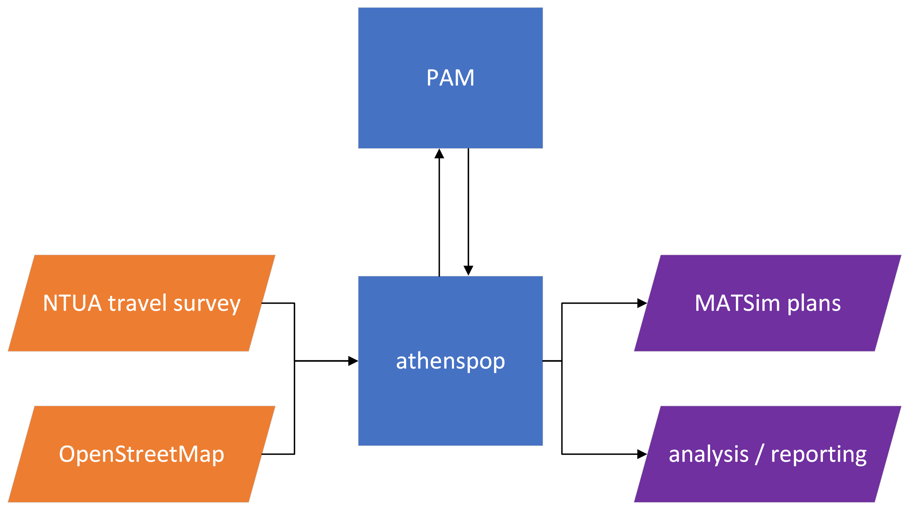
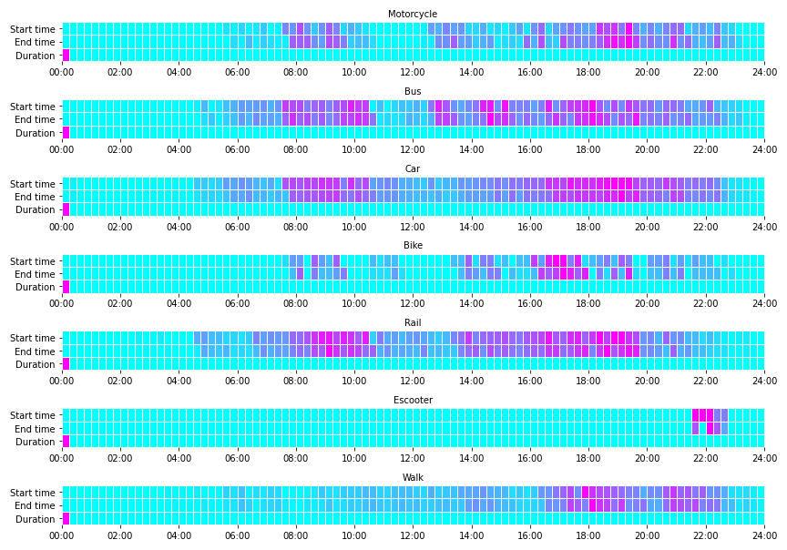

# athenspop: Athens Population Synthesis 
<br>


Developing and analysing synthetic and activity-based mobility demand scenarios for Athens Metropolitan Area, Greece.

<!-- TOC depthfrom:2 -->

- [Introduction](#introduction)
- [Gettting started](#gettting-started)
    - [Installation](#installation)
        - [Ubuntu / Mac OS](#ubuntu--mac-os)
        - [Windows](#windows)
    - [Running via the command-line interface](#running-via-the-command-line-interface)
    - [Data Requirements](#data-requirements)
- [Examples](#examples)
- [Next steps](#next-steps)
- [Main Collaborators - Research Team](#main-collaborators---research-team)

<!-- /TOC -->

## Introduction
The aim of this repo is to demonstrate methods for the creation of a synthetic MATSim population for Athens Metropolitan Area (AMA), using the open-source [Population Activity Modeller (PAM)](https://github.com/arup-group/pam) library. PAM is a python API for activity sequence modelling, focusing on the generation and modification of travel demand scenarios.

**Why?**: Transport planners and decision-makers are increasingly facing difficult questions, such as decarbonisation and transport equity, which require appropriate tools and data to help us answer them effectively. The limited availability of disaggregate mobility data creates insuperable obstacles in the assessment of sustainable mobility measures and policies. Activity- and agent-based modelling techniques provide us with bottom-up approaches for simulating complex travel patterns, focusing on the behavioural drivers behind invividuals' travel decisions. Through simple examples and case studies, we wish to demonstrate such approaches and gain better understanding of existing datasets.

**How?**: We employ statistical analysis, machine learning, and data fusion methodologies, typically through the PAM interface. All the tools have been developed in [Python](https://www.python.org)

**What does it produce**: Athenspop can be used for the analysis and visualisation of the NTUA travel survey data, or the creation of experimental synthetic and disaggregate demand scenarios. These toy scenarios can be imported in ABMs, like MATSim.

<br>

<br>

## Gettting started

### Installation

The installation of athenspop requires the creation of a virtual environment These can be achieved by installing [virtualvenv](https://virtualenv.pypa.io/en/latest/installation.html) package. 

Spyder or Jupyter users: Keep in mind that the [spyder_kernels](https://pypi.org/project/spyder-kernels/) will not automatically installed in the virtual environment. Please install them before runinng the models in this new environment.

You can install the library as follows:

#### Ubuntu / Mac OS

```
git clone git@github.com:Theodore-Chatziioannou/athenspop.git
cd athenspop

virtualenv -p python3 venv
source venv/bin/activate
pip3 install -e .
```

#### Windows

```
git clone git@github.com:Theodore-Chatziioannou/athenspop.git
cd athenspop

conda create -n venv python=3.8
conda activate venv
conda install geopandas
pip3 install -e .
```

### Running via the command-line interface
Athenspop can be also used via its Command Line Interface (CLI). Once the athenspop library is install, you can run `athenspop --help` to discover the available options.

```
$ athenspop create population --help

> Usage: athenspop create population [OPTIONS] INPUTS_PATH
> 
> Options:
>   -o, --path_outputs TEXT     Path to the output population.xml file.
>   -f, --path_facilities TEXT  Path to the facility (land use) dataset
>                               (optional).
>   --help                      Show this message and exit.
```

Therefore, to create a new population you can run:
```
athenspop create population <travel_survey_directory> -o <output_directory>
```

For example, using the dummy dataset under `tests/example_data` :
```
athenspop create population ./tests/example_data -o ./outputs
```

### Data Requirements
The repo examples use the NTUA's travel survey as an input. The 509 diaries are self-reported in an online questionnaire, which has been advertised through the radio broadcast and online media of the [Hellenic Broadcasting Corporation - ERT](https://www.ert.gr).

To get a copy of the data please get in touch with the repo's owners. Below, you can find their emails.

## Examples

The library includes a number of examples under the `examples` directory:
* `01_Create_Simple_Athens_Population.py`: creates a simplistic toy population by resampling and converting the travel diary data to a MATSim-compatible demand file in .xml format.
* `02_Create_Population_OSM_landuse.py`: as above, but using OSM land-use data for facility sampling.
* `03_Analysis.py`: Demonstrates some reporting and visualisation methods.
* `04_Clustering_demo.py`: Activity-temporal clustering of the travel diaries.

More examples are coming, see next steps..

<br>


Mode choice - Temporal variations in Athens Metropolitan Area,
with synthetic travelers equal to 0.1% of the total population


## Next steps
The athenspop repo is still under development. We aim to further enrich it with more data inputs and methodologies, supporting the development of more complex and/or realistic demand representations. The demand scenarios can now be used for research, experimental or educational purposes.

The next (planned) steps aim to "feed" the athenpop algorithms with new info. These are:
* Demonstrate some plan choice methods (for example, mode choice or plan generation);
* Apply more complex re-sampling approaches (such as IPF);
* Fuse microdata with more aggregate statistical distributions;
* Data cropping considering smaller urban areas and external zones;
* Use of detailed land use shapefiles for AMA to resample spatial patterns more accurately;
* New visualisations of synthetic data.

## Main Collaborators - Research Team
1) Theodoros Chatziioanou, Senior Data Scientist, City Modeling Lab, ARUP, Theodore.Chatziioannou@arup.com 
2) Panagiotis G. Tzouras, Researcher, Laboratory of Transportation Engineering, National Technical Unviversity of Athens, ptzouras@mail.ntua.gr 
